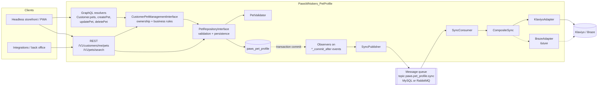

# PawsWhiskers_PetProfile

Pet Profile feature for Paws & Whiskers Co. Registered customers can store profiles for their pets.
The data is structured so it can later drive product recommendations, customer segmentation and
marketing automation (Klaviyo, Braze), and it can be shared with other business systems without
changing the core module.

Target platform: Adobe Commerce / Magento Open Source **2.4.7+**, PHP 8.2 / 8.3.

---

## 1. Architectural overview



### Layers

| Layer | Classes | Responsibility |
|---|---|---|
| API (service contracts) | `Api\PetRepositoryInterface`, `Api\CustomerPetManagementInterface`, `Api\Data\PetInterface`, `Api\Data\PetSyncMessageInterface`, `Api\MarketingSyncInterface` | Stable `@api` contracts. Every entry point (GraphQL, REST, cron, other modules) goes through them. |
| Domain | `Model\CustomerPetManagement`, `Model\PetValidator`, `Model\Config`, `Model\Source\*` | Ownership checks, the per-customer pet limit, field validation, and the closed species/gender vocabularies. |
| Persistence | `Model\Pet`, `Model\ResourceModel\Pet`, `...\Pet\Collection`, `Model\PetRepository`, `etc/db_schema.xml` | Declarative schema, resource model, and a repository built on `SearchCriteria`. |
| Presentation | `Model\Resolver\*`, `etc/schema.graphqls`, `etc/webapi.xml` | GraphQL and REST adapters. They are thin: they resolve the authenticated customer, map input and output, and translate exceptions. |
| Integration | `Observer\*`, `Model\Queue\*`, `Model\MarketingSync\*`, `etc/queue_*.xml`, `etc/communication.xml` | Asynchronous fan-out to marketing platforms. |

There are two service contracts on purpose:

- **`PetRepositoryInterface`** is the trusted persistence API (admin, integrations, segmentation jobs).
  It has no notion of "current customer".
- **`CustomerPetManagementInterface`** is the customer-facing API. Every method takes the customer ID
  from the authenticated context and enforces ownership. GraphQL and the `/me` REST routes only
  ever call this one.

This keeps authorisation in one tested place instead of repeating it in every resolver or controller.

---

## 2. Data storage rationale

### Dedicated flat table, not customer EAV attributes

A customer can have **many** pets, so this is a one-to-many relationship. Customer EAV attributes
model one value per customer. Storing a list there would mean serialised JSON in a varchar/text
attribute, which can't be indexed, filtered or joined efficiently.

A dedicated `paws_pet_profile` table gives:

- **Queryable data for segmentation**, for example
  `WHERE species = 'dog' AND breed = 'Labrador'` or
  `date_of_birth BETWEEN ...` for "puppy" and "senior pet" campaigns.
  EAV would need a join per attribute; a JSON column needs generated columns to index.
- **Referential integrity.** A foreign key to `customer_entity.entity_id` with `ON DELETE CASCADE`
  means no orphaned pets and supports right-to-erasure requests.
- **Predictable performance.** A single narrow InnoDB table with targeted indexes.

### Schema (`etc/db_schema.xml`)

| Column | Type | Notes |
|---|---|---|
| `pet_id` | int unsigned, PK, identity | |
| `customer_id` | int unsigned, FK → `customer_entity`, cascade | Indexed; the most common lookup. |
| `name` | varchar(64), required | |
| `species` | varchar(32), required | A closed code list (`Model\Source\Species`), not free text, so it is usable for rules and segments without clean-up. |
| `breed` | varchar(128), nullable | Free text for now; see *Future work*. |
| `gender` | varchar(16), nullable | `male` / `female` / `unknown` |
| `date_of_birth` | date, nullable | Age is **derived**, never stored, so it never goes stale. |
| `weight_kg` | decimal(6,2) unsigned, nullable | Drives size-based recommendations (food portions, crate sizes). |
| `created_at` / `updated_at` | timestamp | `updated_at` has `ON UPDATE`; usable for incremental exports. |

Indexes: `customer_id` for the customer's own list, and a composite `(species, breed)` for
segmentation queries.

Codes are stored in lower case, while GraphQL exposes them as `UPPER_CASE` enums
(`Model\Resolver\PetDataMapper`). The storage format and the API format can therefore change
independently.

`db_schema_whitelist.json` is generated and committed, so declarative schema can safely roll back.

### Why not a JSON "attributes" column?

It's tempting for flexibility, but it undermines the main business goal: segmentation needs indexed,
typed columns. New structured fields (dietary needs, allergies) should be added as real columns or as
a child table. Extension attributes on `PetInterface` let other modules attach data without changing
this schema.

---

## 3. Service contracts and business rules

- **Validation** (`Model\PetValidator`) runs inside `PetRepository::save()`, so no entry point can
  skip it. It collects all errors into one `InputException`, and GraphQL returns each one as its own
  error. Rules:
  - `name` is required, at most 64 characters.
  - `species` must be one of the allowed codes.
  - `gender` is optional and must be one of the allowed codes.
  - `breed` is at most 128 characters.
  - `date_of_birth` is a real `YYYY-MM-DD` date, not in the future and not more than 50 years ago.
  - `weight_kg` must be greater than 0 and at most 150.
- **Ownership** (`CustomerPetManagement`):
  - `customer_id` is always overwritten from the authenticated context. It is never trusted from
    the payload.
  - Reading, updating or deleting a pet that belongs to another customer throws the same
    `NoSuchEntityException` as a pet that doesn't exist, so IDs can't be enumerated.
- **Per-customer limit.** `paws_pet_profile/general/max_pets_per_customer` defaults to 10 in
  `etc/config.xml`. It is checked on create only, protects against abuse and bounds payload size
  for marketing profiles. Setting it to `0` disables the limit.
- **Partial updates.** `updatePet` loads the current pet and applies only the fields sent, so
  clients don't have to resend the whole object.

---

## 4. Headless / GraphQL API

All pet operations require a customer token. Guests get a `graphql-authorization` error.

```graphql
# Read: pets are a field on the existing Customer type
query {
  customer {
    email
    pets { uid name species breed gender date_of_birth weight_kg }
  }
}

mutation {
  createPet(input: { name: "Biscuit", species: DOG, breed: "Beagle", date_of_birth: "2021-04-02", weight_kg: 11.5 }) {
    pet { uid name species }
  }
}

mutation {
  updatePet(uid: "MQ==", input: { weight_kg: 12.1 }) { pet { uid weight_kg updated_at } }
}

mutation {
  deletePet(uid: "MQ==")
}
```

Design choices:

- **`Customer.pets`, not a new root query.** This follows core conventions (`Customer.addresses`,
  `Customer.orders`) and inherits the existing customer authentication and non-cacheable behaviour.
- **`uid: ID!`** is encoded with `Magento\Framework\GraphQl\Query\Uid`, in line with the 2.4
  guidance to expose opaque IDs rather than database IDs.
- **Enums** (`PetSpecies`, `PetGender`) give clients a typed vocabulary and schema-level validation.
- **Resolvers stay thin.** They resolve the customer (`CustomerContext`), map data (`PetDataMapper`)
  and translate exceptions. All logic lives behind the service contract, so REST and GraphQL behave
  the same.

REST reuses the same contracts:

| Method and route | Service | ACL |
|---|---|---|
| `GET /V1/customers/me/pets` | `CustomerPetManagementInterface::getList` | `self`; `customerId` forced from the token |
| `POST /V1/customers/me/pets` | `CustomerPetManagementInterface::save` | `self` |
| `DELETE /V1/customers/me/pets/:petId` | `CustomerPetManagementInterface::delete` | `self` |
| `GET /V1/pets/search` | `PetRepositoryInterface::getList` | `PawsWhiskers_PetProfile::pets` (admin / integration) |

---

## 5. Asynchronous marketing sync strategy

### Flow

1. `PetRepository::save()` / `delete()` writes the row.
2. The model's event prefix (`paws_pet_profile`) makes Magento dispatch
   `paws_pet_profile_save_commit_after` / `paws_pet_profile_delete_commit_after`.
   These fire **only after the DB transaction commits**.
3. `Observer\PublishPetSaved` / `PublishPetDeleted` call `Model\Queue\SyncPublisher`, which publishes
   a `PetSyncMessageInterface` to the topic `paws.pet_profile.sync`.
4. The consumer `paws.pet_profile.sync` (`Model\Queue\SyncConsumer::process`) handles each message:
   - `upsert`: re-load the pet from the repository and call `MarketingSyncInterface::upsert()`.
   - `delete`: call `MarketingSyncInterface::remove($customerId, $petId)`.
5. `Model\MarketingSync\CompositeSync` fans the call out to every adapter registered in `di.xml`.
   Today that is `KlaviyoAdapter`, a stub that logs the request it would send, because live API
   configuration is out of scope.

### Why these choices

| Decision | Reason |
|---|---|
| **Queue, not a synchronous API call** | A slow or unavailable marketing platform must never slow down or fail a customer's save. The queue also absorbs bursts (imports, campaigns) and allows rate-limited draining. |
| **Publish on `*_commit_after`, not in the repository or `save_after`** | `save_after` runs inside the transaction. A fast consumer could read uncommitted data, or sync a pet whose transaction later rolls back. The commit-after event also covers every write path (repository, admin, import) with one hook. |
| **Messages carry IDs only, no PII** | Personal data doesn't sit in queue tables or broker storage. The consumer re-reads the **current** state, so duplicate and out-of-order deliveries converge on the latest data. Processing is idempotent by design. |
| **Delete messages carry `customer_id`** | The row is gone by the time the consumer runs, so the message must hold everything needed to remove the pet downstream. |
| **Upsert for a pet that no longer exists is skipped** | The pet was deleted after publishing, and the delete message that follows handles removal. |
| **`db` connection by default** | Works on any environment, including a plain MySQL dev setup. Switch to RabbitMQ in production through deployment config only (see below). |
| **SPI + composite** | `MarketingSyncInterface` is the extension point. Adding Braze, or a CDP or ERP feed, is one new adapter class and one `di.xml` item, with no changes to the domain or queue code. |
| **Dedicated log file** | `var/log/pet_profile_sync.log` keeps sync activity auditable and out of `system.log`. Adapters log identifiers, not emails. |

Switching to RabbitMQ in `app/etc/env.php` needs no code change:

```php
'queue' => [
    'amqp' => ['host' => 'rabbitmq', 'port' => 5672, 'user' => '...', 'password' => '...', 'virtualhost' => '/'],
    'topics' => ['paws.pet_profile.sync' => ['publisher' => 'amqp-magento']],
    'consumers_wait_for_messages' => 1,
],
```

Run the consumer with `bin/magento queue:consumers:start paws.pet_profile.sync`, under Supervisor in
production. Alternatively, let `cron_consumers_runner` spawn it.

### Reliability: known gaps and how to close them

- **Publish failure after commit.** If the broker is down, `SyncPublisher` logs the error and the
  customer's request still succeeds, so that change is lost to the marketing platform. Two ways to fix
  that for production:
  - a **transactional outbox**: write the event to a `paws_pet_profile_outbox` table in the same
    transaction as the pet, then relay it to the queue with cron; or
  - a **nightly reconciliation**: push every pet with `updated_at` greater than the last successful
    sync. The upsert is idempotent, so replaying is safe.
- **Retries and dead-lettering.** The consumer rethrows adapter exceptions so the framework rejects
  the message. With AMQP, configure a dead-letter exchange and a bounded retry with back-off. With the
  MySQL queue, rejected messages are marked in `queue_message_status` for inspection. Adapters should
  classify errors:
  - HTTP 429 or 5xx: retryable.
  - HTTP 4xx validation errors: permanent. Log and acknowledge, don't retry forever.
- **Customer deletion.** The foreign-key cascade removes pets without firing model events. A
  `customer_delete_commit_after` observer should publish a "remove all pets for customer" message.
  The simpler alternative is to rely on the platform's own profile deletion, since the customer
  record is removed there too.
- **Ordering.** Upserts re-read current state, so their order doesn't matter. A delete processed
  before a late upsert is safe, because the upsert finds no pet and is skipped.

---

## 6. Performance considerations

- **Indexed access paths.** `customer_id` covers the storefront list. `(species, breed)` covers
  segmentation. Both are simple equality or range queries on a narrow table.
- **No extension attribute on `CustomerInterface`.** Attaching pets to every customer load (checkout,
  admin grid, `customer` query) would add a query for callers that don't need pets. Pets load only
  when `Customer.pets` is requested, which is GraphQL's natural lazy loading.
- **N+1 queries.** `Customer.pets` resolves once per request (there is one customer per token), so
  batching isn't needed. If pets are later exposed on lists (for example admin customer search
  through GraphQL), switch the resolver to `BatchResolverInterface` and load by
  `customer_id IN (...)`.
- **Caching.** Customer data is private. The `customer` query is already excluded from full-page and
  Varnish caching, and mutations aren't cached. Personal data is never put in a shared cache.
- **Asynchronous side effects.** Marketing latency is completely off the request path. With the
  per-customer limit in place, a save costs one indexed `COUNT(*)`, one write and one queue insert.
- **Bulk operations.** For imports or back-fills, adapters should use the platforms' bulk endpoints
  (for example Klaviyo's bulk profile import) and the consumer's `maxMessages` should be tuned.
  Pets can be grouped by customer so each customer's profile updates once instead of once per pet.
- **Segmentation reads** for recommendations should run on a read replica or through an indexed
  export, not ad-hoc queries on the primary during peak traffic.

---

## 7. Security considerations

- **Authentication.**
  - GraphQL resolvers require a customer token (`CustomerContext`).
  - REST `/me` routes use the `self` resource, and `customerId` is `force="true"` from
    `%customer_id%`, so a client can't send someone else's ID.
- **Authorisation / IDOR.** Ownership is enforced in the service layer, not the transport layer.
  Foreign pets look exactly like missing pets.
- **Admin access.** The search API is protected by a dedicated ACL resource,
  `PawsWhiskers_PetProfile::pets`, grantable to integrations and roles separately from customer
  management.
- **Input validation.** Server-side validation runs on every save:
  - closed vocabularies for species and gender;
  - length limits that match the column sizes;
  - date sanity checks and numeric bounds.
  All database access goes through the resource model and parameter binding, so there is no SQL
  injection surface. Output escaping is the storefront's job; the API returns raw strings.
- **Abuse limits.** A per-customer pet cap. GraphQL query complexity and depth limits (core
  `graphql/validation` config) plus rate limiting at the CDN or WAF protect the mutations.
- **Data minimisation and privacy.**
  - Queue messages contain only IDs.
  - Sync logs exclude email addresses.
  - Pet data is linked to a customer, so it is personal data. It is removed by the FK cascade when a
    customer is deleted, and should be included in any data export or erasure tooling.
- **Marketing consent.** Before a real adapter sends anything, it should check the customer's
  marketing consent (newsletter subscription or a dedicated consent flag) and send only the
  attributes the privacy policy allows.
- **Secrets.** Platform API keys belong in encrypted system config (`backend_model` `Encrypted`) or
  `env.php`, never in code or `config.xml`.

---

## 8. Testing

Unit tests live in `Test/Unit` and focus on core business logic. There are 32 tests with 61
assertions, all passing on 2.4.7 with PHPUnit 9.6.

| Test | What it proves |
|---|---|
| `Model/PetValidatorTest` | Every validation rule (required name, length limits, closed species and gender lists, real and plausible birth dates, weight bounds), that a future birth date is rejected, and that multiple errors are reported together. |
| `Model/CustomerPetManagementTest` | `customer_id` always comes from the authenticated customer, never the payload. The pet limit applies on create only, and a limit of `0` disables it. Reading, updating or deleting another customer's pet raises `NoSuchEntityException` and never reaches the repository's `save`/`delete`. |
| `Model/Resolver/PetDataMapperTest` | Every validation error becomes its own GraphQL error. GraphQL `UPPER_CASE` enums map to the stored codes. Updates apply only the fields sent. Output uses opaque `uid`s. |
| `Model/Queue/SyncConsumerTest` | An upsert syncs the re-loaded current state. An upsert for a pet that was deleted is skipped quietly. A delete removes the pet without loading it. An adapter failure is logged and rethrown so the message can be retried. An unknown operation is dropped with a warning. |

```bash
vendor/bin/phpunit -c dev/tests/unit/phpunit.xml.dist app/code/PawsWhiskers/PetProfile/Test/Unit
vendor/bin/phpcs --standard=Magento2 --extensions=php,xml,graphqls app/code/PawsWhiskers/PetProfile
```

The module passes the `Magento2` coding standard with no errors or warnings.

Recommended next steps are API-functional tests (`dev/tests/api-functional`) for the GraphQL
mutations, including the "another customer's pet" case, and an integration test that asserts a
message is published only after commit.

---

## 9. Installation

```bash
# as app/code/PawsWhiskers/PetProfile, or: composer require paws-whiskers/module-pet-profile
bin/magento module:enable PawsWhiskers_PetProfile
bin/magento setup:upgrade
bin/magento queue:consumers:start paws.pet_profile.sync   # or rely on cron_consumers_runner
```

Configuration (`etc/config.xml` defaults, override with `bin/magento config:set`):

| Path | Default | Meaning |
|---|---|---|
| `paws_pet_profile/general/max_pets_per_customer` | `10` | `0` disables the limit |
| `paws_pet_profile/general/marketing_sync_enabled` | `1` | Stops publishing sync messages when `0` |

---

## 10. Out of scope / future work

- Storefront UI, admin grids and forms, and `system.xml` for the settings (out of scope per the brief).
- A live Klaviyo or Braze client: HTTP client, retries with back-off, mapping to the platform's
  profile schema, and the consent check.
- A transactional outbox and a reconciliation cron (section 5).
- A breed catalogue table (`species` → `breed`) to replace free-text breed, which gives cleaner
  segmentation.
- Product recommendations: map species, size and age to category or attribute rules. One option is a
  `catalog_product` attribute such as `suitable_species` used by a recommendation resolver, or data
  passed to Adobe Sensei / Live Search.
- Pet photos through the media gallery or a storage abstraction, with upload validation.
- Emitting Adobe I/O Events (`Magento_AdobeIoEventsClient`) from the same commit-after hook, to reach
  other business systems through App Builder without extra Magento code.
